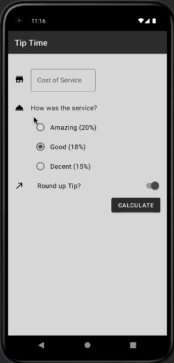

# Tip Time

An Android app to calculate the tip.

## Description

Enter the cost of service and choose the quality of the service. Then, choose whether or not to round the tip up and simply hit calculate to get the tip amount. 

### Features
Tells you to enter a value if there is no value given.

## Authors

Alicia Shi